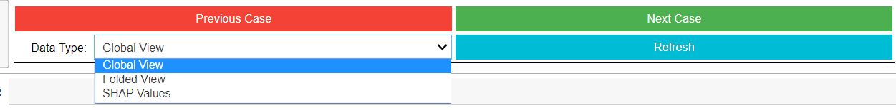

# Exoplanet-Vetting-Tool 
The vetting tool is to help people explore results from our exoplanet detection model in an interactive way without any knowledge of the underlying machine learning methods and the feature calculation techniques.

## How to run the tool:
1. [open binder](https://mybinder.org/v2/gh/abhmalik/Exoplanet-Vetting-Tool/master) and run `Vetting-Tool.ipynb`
2. Run both the code blocks and the tools will initiate. After you successfully start the tool you should see the following buttons:

## Structure of the tool:
- Global View: Full view of the lightcurve
- Folded View: Folded or local view i.e. lightcurve shown in phase
- SHAP Values: SHAP Values breaks down a prediction to show the impact of each feature. Here you'll see top 10 features that were important for this prediction.
